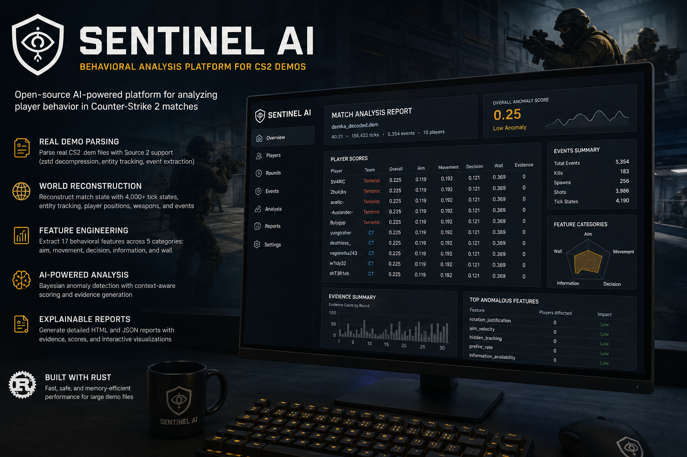

<p align="center">
  
</p>

<h1 align="center">
Sentinel AI
</h1>

<p align="center">

<strong>Explainable AI for Counter-Strike 2 Match Intelligence</strong>

Analyze CS2 demos, reconstruct player behavior, generate explainable evidence and detect statistical anomalies using modern behavioral analytics.

</p>

<p align="center">


</p>

---

# Overview

Sentinel AI is an open-source behavioral analysis platform for Counter-Strike 2.

Unlike traditional anti-cheat systems, Sentinel never injects into the game, never reads process memory and never interferes with gameplay.

Instead it reconstructs an entire match from a demo file and performs explainable statistical analysis of player behavior.

The result is a transparent report describing *why* specific actions appear unusual instead of producing an opaque "cheater / not cheater" verdict.

---

# Philosophy

Sentinel is **not another anti-cheat**.

It is a behavioral intelligence platform.

```
CS2 Demo
      │
      ▼
World Reconstruction
      │
      ▼
Feature Extraction
      │
      ▼
Behavior Analysis
      │
      ▼
Evidence Engine
      │
      ▼
Explainable Report
```

---

# Features

## Source 2 Demo Support

- Source 2 parsing
- zstd compressed demos
- entity tracking
- round reconstruction
- event extraction

---

## World Reconstruction

Sentinel rebuilds the entire match state.

✔ Players

✔ Teams

✔ Weapons

✔ Tick timeline

✔ Round information

✔ Event graph

---

## Feature Extraction

Current implementation computes dozens of behavioral metrics including:

- Aim Velocity
- Hidden Tracking
- Rotation Justification
- Information Availability
- Solo Playstyle Index
- Team Proximity
- Trade Participation
- Utility Support
- Decision Timing
- Movement Statistics

Feature vectors are generated for every player across the entire match.

---

## Explainable AI

Instead of:

```
Player is cheating
```

Sentinel produces:

```
Round 18

Hidden Tracking

Visibility:
No

Audio:
No

Radar:
No

Tracking Duration:
1.42 seconds

Confidence:
92%
```

Every anomaly is backed by evidence.

---

# Pipeline

```
Source2 Demo
      │
      ▼
Demo Parser
      │
      ▼
Entity Tracking
      │
      ▼
Event Extraction
      │
      ▼
World Reconstruction
      │
      ▼
Feature Extraction
      │
      ▼
Bayesian Analysis
      │
      ▼
Evidence Engine
      │
      ▼
HTML / JSON Report
```

---

# Current Capabilities

✔ Source2 demo parsing

✔ Event extraction

✔ World reconstruction

✔ Feature engine

✔ Bayesian scoring

✔ Evidence generation

✔ HTML reports

✔ JSON reports

✔ CLI

✔ Dataset calibration

✔ Golden testing

✔ Statistical models

✔ Ensemble models

---

# Analysis Example

```
Match

Duration:
40 minutes

Ticks:
156,422

Players:
10

Events:
5,354

Feature vectors:
87,990

Evidence:
329/player
```

---

Player example

```
SV4RiC

Aim
0.119

Movement
0.192

Wall
0.369

Overall
0.225
```

---

# Report

Sentinel generates

- HTML Report
- JSON Report

The HTML report includes

- score visualization
- category breakdown
- evidence
- player comparison
- anomaly summaries

---

# Repository Structure

```
sentinel/

crates/

    sentinel-core

    sentinel-demo

    sentinel-events

    sentinel-world

    sentinel-map

    sentinel-geometry

    sentinel-visibility

    sentinel-features

    sentinel-analysis

    sentinel-evidence

    sentinel-report

    sentinel-cli

    sentinel-ui

datasets/

docs/

examples/

tests/

assets/
```

---

# Installation

Clone

```bash
git clone https://github.com/YOUR_NAME/sentinel.git

cd sentinel
```

Build

```bash
cargo build --release
```

---

# CLI

Analyze

```bash
sentinel analyze match.dem
```

Calibration

```bash
sentinel calibrate calibration.json
```

Statistics

```bash
sentinel stats vectors.json
```

Verification

```bash
sentinel verify
```

---

# Output

```
reports/

match.html

match.json
```

---

# Design Principles

Sentinel follows six core principles.

## Deterministic

Same input.

Same output.

Always.

---

## Explainable

Every score must have evidence.

---

## Modular

Every subsystem is an independent Rust crate.

---

## Testable

Golden tests

Regression tests

Calibration datasets

---

## Reproducible

Results can be reproduced across machines.

---

## Research Friendly

Designed for experimentation and statistical validation.

---

# Performance

Typical Premier Match

```
Ticks

156,000+

Players

10

Events

5,000+

Feature vectors

80,000+

Analysis

<10 seconds
```

(depending on hardware)

---

# Roadmap

## Phase 1

Core Architecture

✅

---

## Phase 2

Source2 Integration

✅

---

## Phase 3

Behavior Analysis

✅

---

## Phase 4

Evidence Engine

✅

---

## Phase 5

Calibration

✅

---

## Phase 6

Visibility Engine

🚧

---

## Phase 7

Interactive Replay Viewer

🚧

---

## Phase 8

Machine Learning Validation

🚧

---

# Why Sentinel?

Traditional anti-cheats answer:

> Is there a cheat running?

Sentinel asks:

> Does this player's behavior statistically deviate from legitimate gameplay?

That distinction enables transparent, reproducible, and explainable analysis.

---

# Disclaimer

Sentinel is a research and analytics platform.

It does **not**:

- inject into Counter-Strike 2
- modify gameplay
- bypass Valve Anti-Cheat
- inspect process memory

Anomaly scores are statistical indicators intended to assist analysis. They are not definitive proof of cheating.

---

# Contributing

Contributions are welcome.

Please read

- CONTRIBUTING.md
- CODE_OF_CONDUCT.md

before opening a Pull Request.

---

# License

MIT License

---

# Acknowledgements

Valve

Rust Community

Open Source Contributors

Counter-Strike Community

---

<p align="center">

Built with Rust.

Designed for explainable behavioral intelligence.

</p>